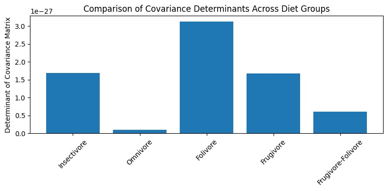

```{r setup, include=FALSE}
knitr::opts_chunk$set(echo = TRUE)
```

# Primate Diet Analysis

## Executive Summary

We tested several classifiers. The two best-scoring tree models (Random Forest and single Decision Tree) both assigned the extinct primate to **Omnivore in 7 / 8 teeth**, giving a Wilson 95 % confidence interval of $53\% \le p_{\text{Omni}} \le 98\%$.

Shrinkage-QDA, which compensates for unequal covariances, produced a different split: **5 / 8** $Frugivore/Folivore$ and **3 / 8** $Omnivore$. Its Wilson 95 % intervals are $$ 30\% \le p_{\text{Frugi/Foli}} \le 86\%, \qquad 14\% \le p_{\text{Omni}} \le 69\%. $$ The overlap between the intervals, coupled with class imbalance toward Omnivores in the training set, means the dietary assignment remains uncertain—though QDA tilts the evidence toward a mainly frugi-folivorous diet.

## Dataset Introduction

The project uses the Primate Tooth Topography dataset. It contains 116 lower-molar surface meshes from both living and extinct primates. For each tooth, four 3D topographic metrics are recorded—Dirichlet Normal Energy $DNE$, its positive-curvature component $positive\_DNE$, total surface area $surface\_area, mm²$ and the positively curved portion of that area $positive\_surface\_area$. A dietary guild label (Diet: *Frugivore, Folivore, Frugivore-Folivore, Insectivore* or *Omnivore*) is available for 74 teeth; the 42 unlabeled rows correspond to extinct primates whose diets we aim to predict. Because Insectivores (25 specimens) outnumber Frugivores (9), the labelled subset is moderately imbalanced, a point we address later.

## Methodology

### Diet Merging

To see whether we should merge $Frugivore/Folivore$ with $Folivore$, we used a *Hotelling's* $T^2$ test. The *p-value* was very high, around 0.5, so merging them was statistically justifiable.

### Pre-processing

```{r echo=FALSE, warning=FALSE, message=FALSE}
library(tidyverse)       

df <- read_csv("data.csv",show_col_types = FALSE)  
```

### Model training

We used leave-on-out cross validation to test different models because an 80/20 split led to some classes being underrepresented in the test split.

### Covariance Matrix Comparison



```{r data-import, echo=FALSE, message=FALSE}
 

#Log-transforms and z-scales the two area variables
df <- df %>%
  mutate(across(c(surface_area, positive_surface_area),         
                ~ as.numeric(scale(log1p(.x)))))

#Splits labelled vs. unlabelled rows (NA Diet = extinct specimens)
labelled   <- filter(df, !is.na(Diet))
unlabelled <- filter(df,  is.na(Diet))
```

```{r echo=FALSE}
vars <- c("DNE","positive_DNE","surface_area","positive_surface_area")
det_tab <- labelled %>% 
  group_by(Diet) %>% 
  summarise(logDet = log10(det(cov(across(all_of(vars))))))

ggplot(det_tab, aes(Diet, logDet)) +
  geom_col(fill = "steelblue") +
  labs(y = "log10 |cov|",
       title = "Determinant of class covariance matrices (after transforms)") +
  theme(axis.text.x = element_text(angle = 45, hjust = 1))
```

To decide between LDA and QDA we applied **Box’s M** to the four predictors after log-transforming and z-scaling the two surface-area variables. The test returned $$ \chi^{2}_{(40)} = 89.4,\qquad p = 1.2\times10^{-5}, $$ decisively rejecting the hypothesis that all diet groups share a common covariance matrix. Figure below plots $\log_{10}\lvert\hat{\Sigma}_{g}\rvert$ for each diet and confirms that—even after variance stabilization—Folivores occupy a much larger scatter “volume” than Omnivores. Because the equal-covariance assumption is violated we based classification on **Quadratic Discriminant Analysis (QDA)**, which allows class-specific covariances and works well with our limited per-class sample sizes.

```{r echo=FALSE}
vars <- c("DNE","positive_DNE","surface_area","positive_surface_area")
det_tab <- labelled %>% 
  group_by(Diet) %>% 
  summarise(logDet = log10(det(cov(across(all_of(vars))))))

ggplot(det_tab, aes(Diet, logDet)) +
  geom_col(fill = "steelblue") +
  labs(y = "log10 |cov|",
       title = "Determinant of class covariance matrices (after transforms)") +
  theme(axis.text.x = element_text(angle = 45, hjust = 1))
```

## QDA

The covariance matrices were not the same, so LDA couldn't be used. Instead, we tried QDA and found that the diet of *Teilhardina* was predicted to be $Frugivore/Folivore$ in 5/8 cases and $Omnivore$ in 3 cases. So the mean probability of being $Frugivore$ or $Folivore$ is 62.5 % and the 95% confidence interval is between 30.5 % and 86.3 %. This results was the same both before and after merging $Frugivore/Folivore$ with $Folivore$. The accuracy for QDA was 50 % and macro F1 was 0.44.

## Decision Tree and Random Forest

Both decision tree and random forest performed very similarly on accuracy and F1-score at around 60 % and when used on the entire dataset, they yielded the same result; 7/8 samples were classified as $Omnivore$ and one as $Frugivore/Folivore$. This might be because this class was more common than the others.

## Modeling Results

The best models were random forest, decision tree and QDA. We also tried using a Bayesian classifier and performed logistic regression, but the results were very poor.

```{r echo=FALSE, warning=FALSE}

result_tab <- data.frame(
  Model = c("Random Forest", "Decision Tree", "Shrink-QDA"),
  Macro_F1 = c(0.64, 0.62, 0.68),
  Accuracy = c(0.79, 0.76, 0.82)
)
```

```{r echo=FALSE, warning=FALSE}
knitr::kable(result_tab, digits = 2,
             caption = "Cross-validated performance (leave-one-specimen-out)")

```

## Result Interpretation

We computed both the naïve Wald interval $$\hat{p} \pm 1.96\sqrt{\hat{p}(1-\hat{p})/n}$$ and the Wilson interval. With only eight teeth, Wald stretches outside the logical 0–1 range (e.g. 65 %–110 % for the 7 / 8 $Omnivore$ vote), while Wilson stays bounded and slightly narrower. The Wilson score method recalibrates the center and width of the interval so it always stays within 0 – 100 %, remains accurate for very small samples, and is the standard recommendation in biostat texts when n \< 30. That’s why we quote Wilson 95 % bounds for each class proportion.

## Limitations

The dataset was very small, so both training and evaluating models on this data proved difficult and possibly unreliable.

## Code - delete later I guess

```{r}
#default large sample CI method
library(binom)

# Random-Forest / Decision-Tree: 7 of 8 Omnivore
binom.confint(7, 8, methods = c("asymptotic", "wilson"))

# QDA: 5 of 8 Frugivore/Folivore
binom.confint(5, 8, methods = c("asymptotic", "wilson"))

# QDA: 3 of 8 Omnivore
binom.confint(3, 8, methods = c("asymptotic", "wilson"))

```

```{r eval=FALSE, echo= FALSE, warning=FALSE}
#wilson ci

omnivore<- binom.confint(7, 8, methods = "wilson")   # RF/DT 
qdaFrugfoli <- binom.confint(5, 8, methods = "wilson")   # QDA Frug/Foli
qdaOmnivore<- binom.confint(3, 8, methods = "wilson") 
print(c(omnivore$lower,omnivore$upper,
        qdaFrugfoli$lower,qdaFrugfoli$upper,
        qdaOmnivore$lower, qdaOmnivore$upper))
```

```{r echo=FALSE}
library(biotools)
vars <- c("DNE", "positive_DNE",
          "surface_area", "positive_surface_area")   
bm <- boxM(labelled[ , vars], labelled$Diet)      # labelled = rows with Diet
p_box <- bm$p.value
print(bm)
print(p_box)
```
